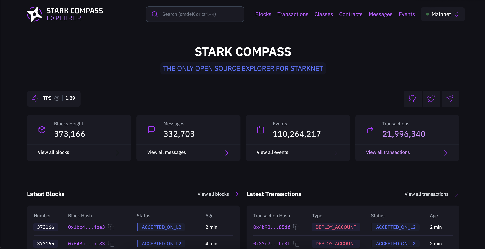

# StarknetExplorer


- [Requirements](#requirements)
- [Local development](#local-development)
  - [RPC Provider](#rpc-provider)
  - [RPC with Juno](#rpc-with-juno)
  - [Database](#database)
  - [Up and running](#up-and-running)

## Requirements
- SQLite
- Erlang 25
- Elixir 1.15, compiled with OTP 25
- Docker (optional)

## Local development

If you run `make` it will print out the available targets: 
```
% make            
Usage:
    run   : Starts the Elixir backend server.
    setup : Sets up everything necessary to build and run the explorer.
    deps  : Gets code dependencies.
    db    : Runs the database creation and migration steps.
```

### Setup
Once you have the requirements installed and set up, you can proceed to building and running the project. 

```bash
make setup
```

### RPC Provider

You now have the choice of connecting the explorer to an RPC API provider of your choice, e.g. Infura with an API key, or by running your own Juno node. 

To run it locally, you'll need to set the RPC API url of the network. If you're using a provider like Infura, this will look something like this: `https://starknet-mainnet.infura.io/v3/your_api_key`

Set the following environment variables:

```bash
export RPC_API_HOST=your_rpc_hostname
export TESTNET_RPC_API_HOST=testnet_rpc_hostname
export TESTNET_2_RPC_API_HOST=testnet_2_rpc_hostname
```

### RPC with Juno

```bash
docker-compose up juno
```

You'll need a Mainnet Ethereum RPC provider for this to
work, set with the env variable `$ETH_NODE_URL`, mind you
it must be a websocket url.

### Database
You can fill an sqlite database with RPC provided data with 2 tools we provide:

1. BlockListener, which will store any new blocks.
To enable this process, before starting the explorer, set this env var:

```bash
export ENABLE_LISTENER="true"
```

2. BlockFetcher, which will store blocks from a given range.
To use it, you simply have to call the `StarknetExplorer.BlockFetcher.fetch_in_range`
function, you can do this interactively after starting with `make run`:

```elixir
StarknetExplorer.BlockFetcher.fetch_in_range(%{start: 100, finish: 10, network: :mainnet})
 ```

Or, if you're on a "prod" environment, simply send it through elixir's RPC:
```bash 
./_build/prod/rel/starknet_explorer/bin rpc "StarknetExplorer.BlockFetcher.fetch_in_range(%{start: 100, finish: 10, network: :mainnet})"
```

There are 2 things to keep in mind here:
1. Amount of requests:
   If you have any constraint on how many requests you can make: keep an eye on that,
   because the fetcher can do a lot of requests per second.
2. Disk Usage: We're still measuring it, but we expect it to be considerable 
   after running it for a couple of days.

The db file will be stored under `/priv/repo`.

### Up and running
If you're on MacOS, you already have SQLite.
On Linux, your distro's repo will most certainly have a package for it.
With a working RPC set and sqlite installed, start the explorer with

```bash
make setup run
```

This will setup the explorer start it on `localhost:4000`.

From now on, if you want to restart the app, you can just do:

```bash
make run
```
